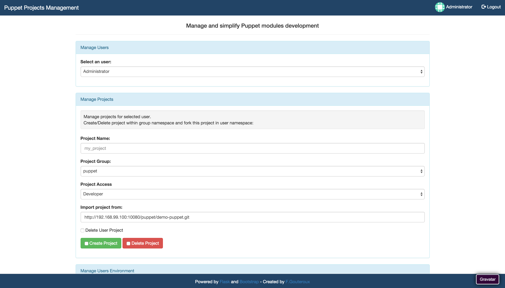
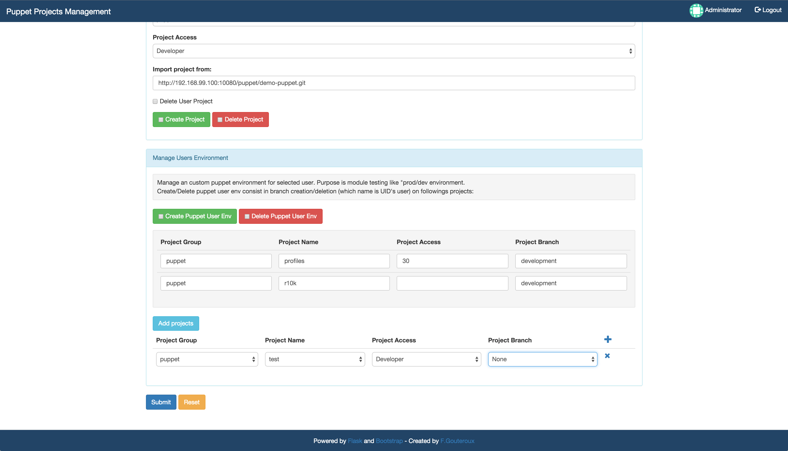

## Flask App to manage puppet projects.

- Oauth Authentication with Gitlab
- Manage puppet user projects
- Manage puppet user environment with r10k.

**Pre-requisites:**
- Assuming you're ok with: [Git Workflows with Puppet and r10k](http://www.puppetlabs.com/blog/git-workflows-puppet-and-r10k)
- Create an application in user's account profile => [doc](http://doc.gitlab.com/ce/api/oauth2.html)
- One Gitlab admin account
- Have at least one group and one project

## How to test

- Run gitlab/docker-compose.yml from [source](https://github.com/sameersbn/docker-gitlab)
- Create an application in gitlab with url callback http://127.0.0.1:5000/user_sessions/authorized
- Create a group and a project in gitlab
- Replace vars in config.py
- Run flask-app

## Contributors:
- Ahmet Demir | [e-mail](mailto:ahmet2mir+github@gmail.com) | [Twitter](https://twitter.com/ahmet2mir) | [GitHub](https://github.com/ahmet2mir)
- Christophe Richon | [GitHub](https://github.com/crichon)